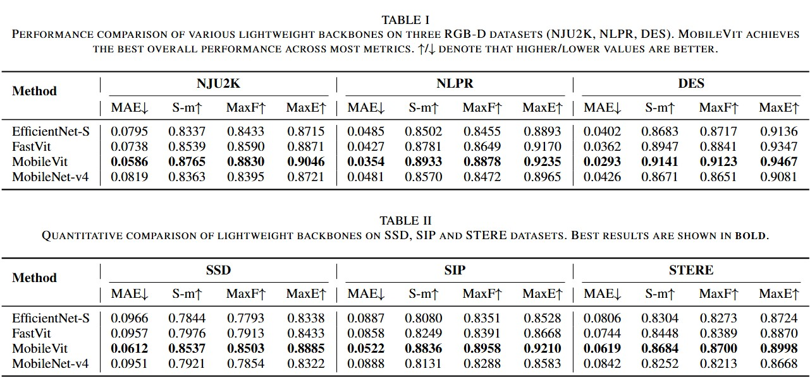
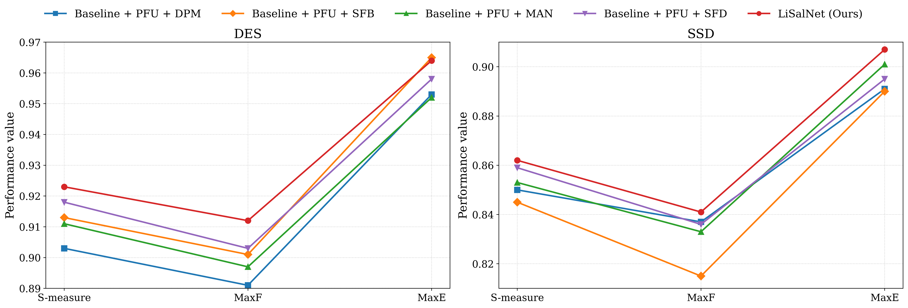

# LiSalNet: Lightweight Saliency Detection Network for RGB-D Images

<div align="center">

[](link-to-paper)
[](LICENSE)
[](https://pytorch.org/)

</div>

## 📋 Overview

**LiSalNet** is an efficient lightweight framework for RGB-D salient object detection that achieves state-of-the-art performance while maintaining exceptional computational efficiency. With only **4.40M parameters** and **1.33 GFLOPs**, LiSalNet delivers **1515 FPS** real-time inference with a compact **16.77MB** model size and **0.5GB** memory footprint.

<div align="center">
  
</div>

## 🔥 Highlights

- **Lightweight architecture with 4.40M parameters achieving 8-15% lower MAE**
- **Hierarchical fusion with MANs and SFBs for scale-adaptive cross-modal alignment**
- **Dilated Perception Module captures multi-scale context without overhead**
- **Parallel Focus Unit refines spatial details and channel responses efficiently**
- **Real-time performance: 1515 FPS, 16.77MB model, 0.5GB memory footprint**

## 🏗️ Architecture

LiSalNet consists of four key components:

1. **Dual-Stream Encoder**: MobileNetV2-based feature extraction for RGB and depth modalities
2. **Hierarchical Cross-Modal Fusion**:
   - **Modality Alignment Networks (MANs)**: Cross-attention mechanisms for low/high-level feature alignment
   - **Symmetric Fusion Blocks (SFBs)**: Bidirectional information exchange for mid-level features
3. **Dilated Perception Module (DPM)**: Parallel dilated convolutions for multi-scale context
4. **Parallel Focus Unit (PFU)**: Dual-path refinement with Dual-Pool Attention Gates and Spatial Detail Refiners

## 📊 Performance

### Quantitative Results

| Method | Params (M) | GFLOPs | FPS | Model Size (MB) | Memory (GB) | NJU2K MAE ↓ |
|--------|-----------|--------|-----|-----------------|-------------|-------------|
| LiSalNet | **4.40** | **1.33** | **1515** | **16.77** | **0.5** | **0.0XXX** |

**Evaluation on 6 Benchmark Datasets**: NJU2K, NLPR, STERE, DES, LFSD, and SIP

### Qualitative Results

<div align="center">
  
</div>

## 🚀 Code & Resources

> **Note**: The complete source code will be publicly available after paper acceptance.

### Available Now

- ✅ **Pre-trained Models**: [Download Models](link-to-models)
- ✅ **Visual Predictions**: [Download Results on All Datasets](link-to-predictions)
  - NJU2K Dataset Predictions
  - NLPR Dataset Predictions
  - STERE Dataset Predictions
  - DES Dataset Predictions
  - LFSD Dataset Predictions
  - SIP Dataset Predictions

### Coming Soon (After Acceptance)

- 🔜 Complete training code
- 🔜 Inference scripts
- 🔜 Model architecture implementation
- 🔜 Preprocessing utilities
- 🔜 Evaluation metrics
- 🔜 Deployment guidelines

## 📦 Installation (Preview)
```bash
# Clone the repository (will be available after acceptance)
git clone https://github.com/username/LiSalNet.git
cd LiSalNet

# Create conda environment
conda create -n lisalnet python=3.8
conda activate lisalnet

# Install dependencies
pip install -r requirements.txt
```

## 🎯 Quick Start (Preview)
```python
# Load pre-trained model
from models.lisalnet import LiSalNet

model = LiSalNet(pretrained=True)
model.eval()

# Inference on RGB-D image pair
saliency_map = model(rgb_image, depth_map)
```

## 📈 Benchmark Datasets

We evaluate LiSalNet on six widely-used RGB-D SOD benchmarks:

| Dataset | Images | Resolution | Year |
|---------|--------|-----------|------|
| NJU2K | 2,003 | 640×480 | 2014 |
| NLPR | 1,000 | 640×480 | 2014 |
| STERE | 1,000 | Various | 2012 |
| DES | 135 | Various | 2014 |
| LFSD | 100 | Various | 2014 |
| SIP | 929 | Various | 2017 |

## 🔧 Training (Coming Soon)
```bash
# Training script will be available after acceptance
python train.py --config configs/lisalnet_config.yaml
```

## 📊 Evaluation (Coming Soon)
```bash
# Evaluation script will be available after acceptance
python evaluate.py --dataset NJU2K --model_path checkpoints/lisalnet_best.pth
```

## 🎓 Citation

If you find LiSalNet useful in your research, please consider citing:
```bibtex
@article{lisalnet2025,
  title={LiSalNet: Lightweight Saliency Detection Network for RGB-D Images},
  author={Author Names},
  journal={Journal Name},
  year={2025}
}
```

## 📧 Contact

For questions and discussions, please contact:
- **Primary Author**: [Email]
- **Lab**: Computational Imaging & Perception Lab, Gachon University

## 🙏 Acknowledgments

This work was supported by [Funding Information]. We thank the authors of the benchmark datasets for making their data publicly available.

## 📄 License

This project is licensed under the MIT License - see the [LICENSE](LICENSE) file for details.

---

<div align="center">

**⭐ Star this repository if you find it helpful!**

</div>




